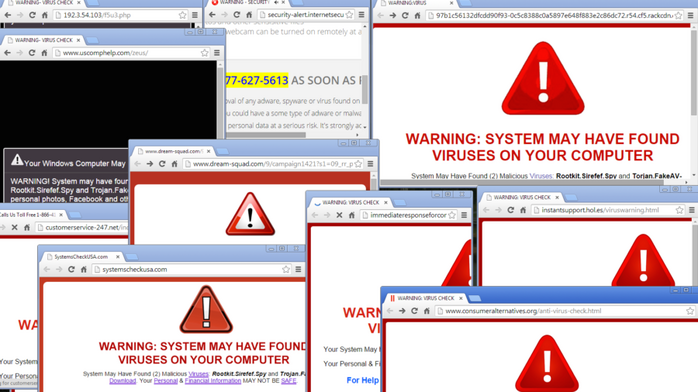

```{=latex}
\setcounter{section}{-1}
```

# Introduction

As the name suggests, computer network defense is a set of actions that
a body/group takes to make sure that there is no unauthorized activity
within its computer network. It is basically the defensive side of Cyber
warfare. A successful defense strategy prevents any attacks and
exploits. 

Attacks include lots of possibilities ranging from taking down systems,
to modifying the data on a system, to misusing resources – basically
anything that affects the availability and/or integrity of a system can
be called an attack.  Exploits, on the other hand, affect the
confidentiality of a system. If data is stolen or published, then that
would fall under the exploit category. 

We shall start our discussion of defense with the three things EVERY
computer user should definitely be doing to every system they use.

# Patch Updates

## The need for updates

Because systems are designed by humans, there are ALWAYS vulnerabilities
being found and/or misused. As we discussed earlier in the quarter, a
vulnerability exists in the “wild” for about 342 days on average before
being discovered. During this time, nefarious characters can use those
vulnerabilities to carry out attacks on a system. After the
vulnerability is discovered, it will take time to design and then
publish a fix for that vulnerability. During this phase, information on
the vulnerabilities and how they can be misused is typically exchanged
by bad actors. After a patch is fixed, it is still up the the user to
download and/or install that patch and from your personal experience,
you know that that might take a long time. As users of these systems, we
have very little control over the time it takes to identify and fix a
vulnerability. However, we do have control over how long it will take up
to download and install that update. Until the patch is installed, all
users aware of the vulnerability can use it to attack your system. 

Bottom line is, **install security updates as soon as possible**. 

## The process of updating

For a linux system, the process of manually updating your system
involves 4 commands. You should find a way of carrying out these
commands as regularly as you can without it significantly affecting your
system availability.

```sh
sudo apt update			# get the latest software inventory
sudo apt upgrade		# based on the inventory, make any updates to 
					    # software I have on my system

sudo apt dist-upgrade	# sometimes there might be some low level 					
                        # software that needs upgrading too.
                        
sudo apt auto-remove	# remove old software or installation files 					
                        # that are no longer being used.
```

:::{.callout-tip}
The first two commands shown above are the most important. The upgrade
command will take some time if its been a while since your last upgrade.
:::

# Malware Protection


“Malicious Software”, or **malware**, is an all encompassing word for any
software designed explicitly to exploit or attack a system. Some of the tell-tale signs that your system has malware include: 

- slow or crashing system, 
- little to no storage space, 
- emails being sent without consent, 
- pop-ups, 
- programs being opened, 
- closed or modifying data on their own, 
- etc. 

## Types of malware

There are a few different types/kinds of malware in existence. However it is
important to realize that while these types might have different
definitions, there are multiple examples of malware that could be
classified under multiple categories. 

1. **Viruses** - Small piece of code inserted into seemingly innocuous
   application or system and are typically deployed by the victim
   themselves. Easily spreads to other files on that system and can do
   things such as destroy data, steal data, send infected files to
   contact lists, launch other attacks on other victims. 

2. **Worms** - Very similar to viruses but do not need human interaction to
   make a copy of itself and doesn’t need to attach itself to a specific
   program to cause damage. Worms can be transmitted via email
   attachments, removable media, etc. 

3. **Bacteria** - This is another name for the fork bomb (or rabbit virus)
   similar to the one you saw earlier in the quarter. This is a program
   that when run takes over system resources by replicating itself. This
   typically results in slower systems, or even crashing the system
   which might seem like a small price for a personal computer but is a
   very high price for other systems that run equipment that should
   never be off. 

4. **Trojans** - A virus that masquerades as a benign program in order to
   persuade a victim to install it. Trojans are named after the famous Trojan horse of Greek mythology.

{fig-align="center" width=70%}

5. **Rootkits** - Software that helps cyber criminals or other malware to
   remain hidden. They will do things like grant access of the system to
   cyber criminals, hide evidence of such access, etc. They don’t
   typically cause serious damage to the system directly but they make
   it easier for other software or people to do so.

6. **Spyware** - Spyware’s purpose, as the name suggests, is to spy on the
   user of the system. They will do things like track internet or system
   activity for any sensitive information e.g. passwords.

7. **Adware** - Malware that supports advertising. Sometimes this will look
   like pop-up ads. Adware also typically is used to provide data on
   your system usage to its designer. Not all adware is malicious but
   they can definitely be annoying.

8. **Ransomware** - Malware that locks and/or encrypts a user’s system and
   requires a payment (usually in bitcoin) to regain access to the
   system. 

While there are lots of types of malware, they are all typically
transmitted in a similar manner and that allows us to either avoid them
or mitigate their effect. Some reports say up to 94% of malware was
delivered by email. Other ways include manual exploitation of security
vulnerabilities, drive-by downloads, social engineering (phishing,
vishing, smishing, etc.)

## Group activity

:::{.callout-important title="group discussion"}
Email use demo: cf ./emailspam/*

In groups of 3-4, read over the provided emails and identify answers to
the following questions:

1. What kind of attack is this?

2. Are there signs that you can see to identify that this is in fact an
   attack? or that it is legitimate?

3. What kind of vulnerabilities (in the cyber and physical realms) does
   this kind of attack need to be successful?

4. How can you defend against this kind of attack?
:::

## Protecting against malware

How does one protect themselves against malware? The only fool proof way
is to never go on the internet and never use a removable device. But
that is too high a price to pay. A more realistic price is being
vigilant. At the beginning of class, we mentioned how the weakest link
in any cyber security system is the human being and this is one of the
reasons. CISA (Cybersecurity and Infrastructure Security Agency) is
pushing for everyone to activate **two factor authentication** and that
is a very good solution to most of the issues. If a piece of software
requires access to both your phone and your computer to send an email
with malicious attachments, then that reduces the likelihood of your
system sending malware to someone else. 

That might stop easy transmission of malware from one victim to another,
but it doesn’t stop a victim from getting it for themselves. Being
**skeptical and vigilant** can help one avoid suspicious links,
websites, and emails. Another way is to tinker with your spam folder
settings so that emails promising you free ipads will never show up in
your inbox to begin with.

**Patch updates.** We have already talked about this but it is worth
mentioning here again. The success or failure of a downloaded piece of
malware will depend on whether you have the appropriate updates or not. 

Installing and updating anti-malware software is another very important
thing one can do to defend against malware. Do your research and find
the software that fits within your budget and does what you want it to
do. 

A final possible fall back is **maintaining backups** of your data. If
all else fails, at the very least you can format your system and restore
the data you have backed up and only lose a few hours or a few days of
data and not everything. This is a good habit to have for more than just
avoiding malware.

# Firewalls

A **firewall** is a security system that monitors and controls incoming and outgoing network traffic based on a set of rules. Firewalls act as a barrier between a trusted internal network and untrusted external networks. This allows us to stop active cyber criminals from
accessing a system or a home network. Firewalls can also stop malware on your system
or network from communicating and therefore propagating to other systems and/or
their designer.

There are two dominant schools of thought on how a firewall might be set
up. Windows comes with a default firewall that blocks connections to
and from the outside world depending on the application that created
that connection. You have to select which applications can connect and
which ones cannot. One downside of this is that you have to interact
with the firewall a little more since you have to change the settings
for any software you want to use that requires an internet connection.

The Linux approach to firewalls is to block connections based on the port
that those connections are using. As you might know from previous
classes, every computer can connect to the internet over 65,536 ports
($2^{16}$). the first 1024 of those are system ports and are typically
used for common services e.g. HTTP on port 80, FTP on 20 and 21, SSH on
22, IMAP on 143, etc. The rest of the ports dynamic and can be used for
any connections you would like. Later on in this class, you will set up
a Linux firewall in an ingenious way to lock out all connections that do
not know about a “secret knock” of yours.


# Other Defenses

While the three techniques we discussed above should be required for all
systems, they are not 100% infallible especially since we are dealing
with humans. There are times when it would be helpful
and beneficial to implement other defensive strategies.

## Virtualization

One of the techniques you have already used in this class is
virtualization. Virtualization allows us to
isolate a portion of the computer and install a completely separate
system on it. This is the approach most people will use when they have
to deal with inherently risky files (e.g. studying viruses), or connect
to risky networks. This allows us to have explicit control over what
kinds of files might be corrupted or affected by nefarious actors.
It also allows us to easily revert to an older snapshot of your
computer if something goes awry. 

The only con is you need to be technically savvy and spend a lot of time
to set up and maintain a virtual machine, especially if the default
settings don’t work for you. Also, because it is only allowed to access
part of your original system e.g. less RAM, it can be slow and
cumbersome to work with. 


## Chroot jails

As background, when you open a file manager on a Linux machine, you are typically put in the home folder. Most of a person’s usual work will be based at home. However, if you go two levels up you get to the root folder at the filepath `/`, and this is the grandparent of all files on the system. 

In the root folder at `/` You can find files used to boot the computer at `/boot/`, programs installed on the computer at `/bin/`, all devices connected to the computer at `/dev/`, and more. Understandably this is a lot of information that anyone
who logs into your computer might have access to. 

A way to deal with the vulnerability of being able to access the root folder is to create a **chroot jail**. The name chroot comes from “change root” which essentially means that you change the root folder for some users. This allows you to create a small subsystem of folders that that user has access to and can never get out of. That is, a **chroot jail** is a way of isolating or restricting access for users of a system. Setting up a chroot jail even means that you determine which programs and utilities a user will be able to access in their jail e.g. can they use `ls`, `mkdir`, etc. 

We discuss and implement chroot jails later in this class. For
those of you who have been trying out bandit, this is probably one of
the ways that system is set up since you cannot see any folders
other than what the designer of the system gives you access to.  

Setting chroot jails up takes way less system resources than
virtualization and is quicker but the jail will have the same OS as the
host and a subset of the tools installed on the host.


## Docker containers

Docker containers are a more recent entry into the isolation game. They
allow users to set up environments with operating systems, and software
that are portable to other users and systems and serve to give users an
isolated environment that has been set up and tested by someone else. It
reduces the amount of work that the end user will have to do to get
their computer set up to tackle a task. 


Isolation software or approaches aren’t the only way to defend against
attacks online. Unfortunately, there are way too many approaches to
discuss in this class but I hope that this has introduced you to a few
of the main ones that anyone can use on their own systems and perhaps
even some enterprise systems.

# Basic Offence

Sometimes a good defense is based on understanding the capabilities of
the offence. Unfortunately, the offense is always growing and wrapping
your mind round all the possibilities is a daunting task. Nonetheless,
let us discuss a couple of things that are commonly done during an
offense i.e. recon/footprinting tactics. 

To look for vulnerabilities (a process done by both attackers and
defenders of a network) some tools can be used. `Nmap` is probably the
most common but others include `nemesis`, `python-scapy`, `netcat`,
`telnet`. For many of these tools, there is some overlap in what they do
but the more you work with them, the more you’ll get a feeling for which
tools work best in what situation. Familiarity with the tool and its
capabilities is one of those factors that will also affect your choice
of tool.


```sh
$ sudo apt install nmap
$ nmap <address or address range>
$ nmap -h	# to see some of the options
$ nmap -Pn <address>	
$ nmap -O <address>
```
Another offensive operation is network sniffing. This involves just
looking at network traffic and then figuring out more specific targets
based on that. The most common tool is `wireshark`.

This is supposed to be small preview of a few tools. We shall dive
deeper into some of them in later lectures. But now that you have heard
about them, nothing stops you from taking a look at a few of them on
your own time.

**References**:

1.  https://www.sciencedirect.com/topics/computer-science/computer-network-exploitation 
2.  https://www.sciencedirect.com/topics/computer-science/computer-network-attack 
3.  https://www.sciencedirect.com/topics/computer-science/computer-network-defense 
4.  https://us.norton.com/internetsecurity-malware-types-of-malware.html#ransomware

