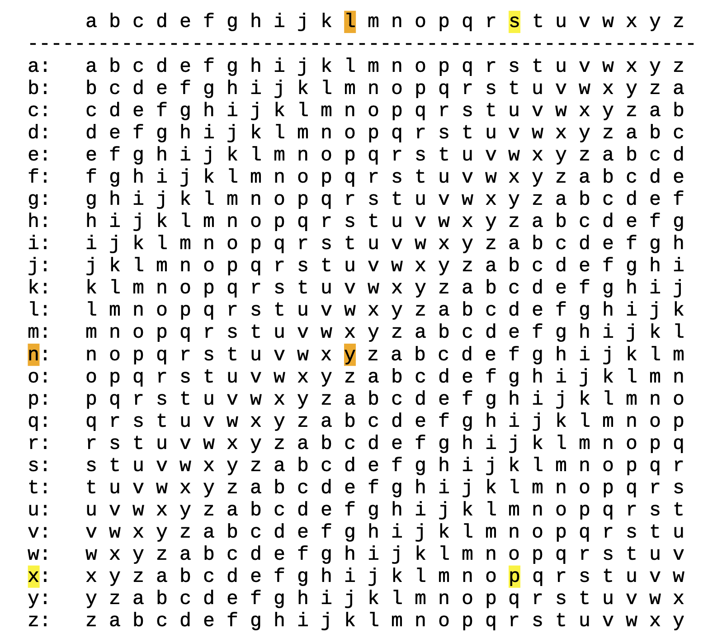
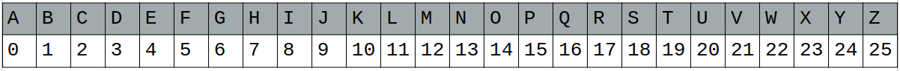
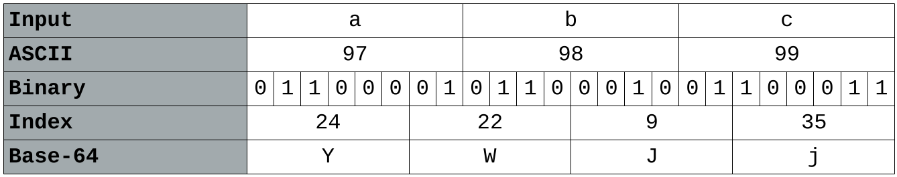
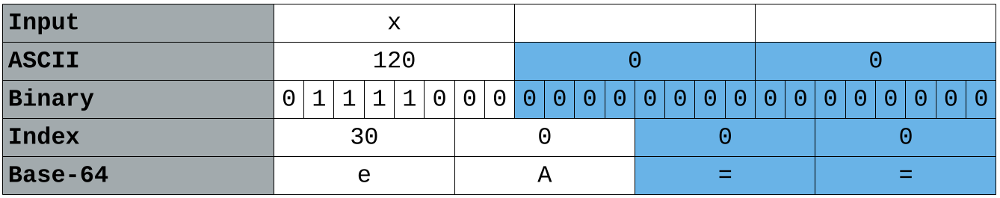
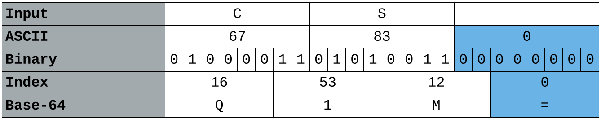
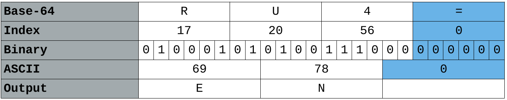
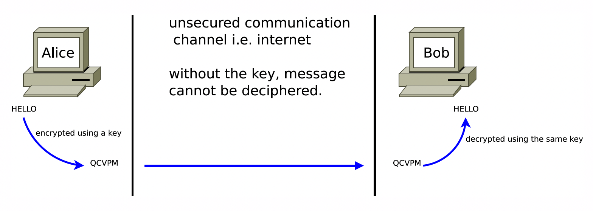
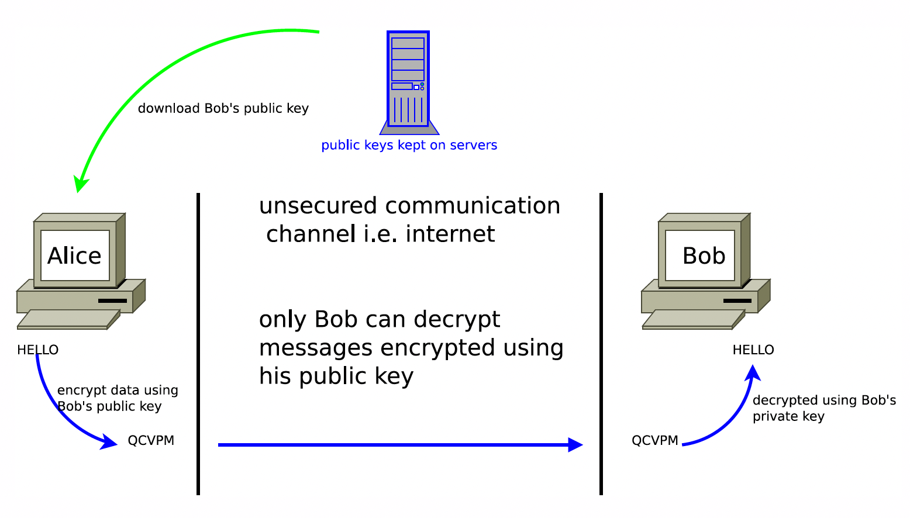

# Introduction

Cryptography has always been about **message confidentiality** — making sure that a
message can only be understood by its sender and intended recipient. It typically
involves converting a message into an incomprehensible format, and then that process
being reversed by the recipient. A good cryptography system should leave a potential
eavesdropper feeling helpless — they should feel like they don't have the time or
energy to figure out what the message says.

Of course, the standard for "time or energy" has changed drastically with computers.
What seemed like an unbreakable cipher to someone working by hand in the 1800s can
now be cracked in milliseconds with a short script. But computers cut both ways — they
also allow us to *create* far more complex encryption systems than any human could
manage by hand.

Even with computers, some categories of problems remain genuinely hard. Recall how
the Towers of Hanoi (from CSC 220 and CSC/CYEN 131) becomes intractable very quickly,
even though the algorithm itself is simple to write. A good cryptography system might
be easy to *understand* — you can explain exactly how it works — but should still
leave even a powerful computer without enough time or memory to recover the original
message.

::: {.callout-note}
## Key Definitions

| Term | Definition |
|---|---|
| **Cryptology** | The overall field: enciphering and deciphering |
| **Cryptography** | The art of *making* a cipher system |
| **Cryptanalysis** | The art of *breaking* a cipher system |
| **Encryption** | Scrambling a message to hide its meaning |
| **Decryption** | Unscrambling an encrypted message |
| **Plain text** | The original, human-readable message |
| **Cipher text** | The encrypted, unreadable message |
| **Cipher** | The algorithm used to perform encryption or decryption |
| **Key** | The secret value that controls how a cipher encrypts or decrypts |
:::

---

# A History of Cryptography

Classical cryptography was done with pen, paper, and occasionally simple mechanical
tools. As you read through each cipher below, think about two questions:

1. **How would you break it?** What is the weakness an attacker could exploit?
2. **How hard would it be with modern technology?** Could a script crack it in under
   a second, or would it take longer?

The highlighted yellow passages are cipher text challenges for you to try and decrypt.

---

## Hieroglyphs *(~3200 BC – 400 AD)*

Ancient Egyptians used images and symbols to represent messages — but only those
initiated into the meaning of the symbols could interpret them. In a sense this is no
different from writing in any natural language: the "secrecy" comes entirely from
obscurity. The more people who know the language, the less effective it is at keeping
messages secret.

::: {.callout-tip}
## How Would You Break It?

Hieroglyphs aren't really a cipher — they're a writing system. Breaking it just means
learning the language, or finding a bilingual key (like the Rosetta Stone, which let
historians decode Egyptian hieroglyphs by comparing the same text written in Greek).
Modern computers could be trained to recognise hieroglyph patterns statistically, but
the "key" here is really just knowledge of the language itself.
:::

---

## Atbash Cipher *(~500 BC – 1300 AD)*

Atbash is a **substitution cipher** where the alphabet is simply reversed: A becomes
Z, B becomes Y, C becomes X, and so on. It is symmetric — applying it twice returns
the original message. Examples of Atbash can actually be found in the Bible [^bible].

[^bible]: See: <https://www.theology.ox.ac.uk/article/crack-the-code>

<p style="text-align:center;"><span style="background-color: #FFFF00">rhm'g xibkgltizksb ufm?</span></p>

You can apply and reverse Atbash on the command line:

```sh
# Create the reversed alphabet z through a
echo {z..a} | tr -d ' '

# Encode or decode a string using Atbash (it's its own inverse)
echo "abcde" | tr a-z "zyxwvutsrqponmlkjihgfedcba"
```

::: {.callout-tip}
## How Would You Break It?

There is only one possible Atbash mapping — there is no key. If you know or suspect
the cipher is Atbash, decryption is instant. Even if you don't know, the small number
of substitution options makes it trivially brute-forceable. A modern script breaks it
in microseconds.
:::

---

## Scytale Cipher *(~7th Century BC)*

The Scytale was a physical encryption device used by the ancient Spartans. A strip of
parchment was wound around a cylindrical rod, and the message was written along the
length of the rod. When the strip was unwound, the letters appeared in a scrambled
order — a **transposition cipher**, meaning the letters are rearranged rather than
substituted. Only a rod of exactly the same diameter could reconstruct the message.

<p style="text-align:center;"><span style="background-color: #FFFF00">Sdeeeiootyrdnnmhdbwgzeareatostaithoattncimihhbhs</span></p>

::: {.callout-tip}
## How Would You Break It?

The "key" here is the diameter of the rod — which controls how many columns the text
is split into. A modern attacker simply tries every possible column width (there are
only as many options as the message is long), reads across each, and checks if the
result is legible English. A script can brute-force every possibility in milliseconds.
:::

---

## Caesar Cipher *(~60 BC)*

The Caesar cipher is another substitution cipher, named after Julius Caesar who
reportedly used it in his personal correspondence. Every letter in the message is
replaced by the letter a fixed number of positions further along in the alphabet,
wrapping around at the end.

Caesar himself shifted by 3 positions: A→D, B→E, C→F, …, X→A, Y→B, Z→C. This
specific version is called **ROT-3**. The most well-known variant today is **ROT-13**,
which shifts by 13 — and because 13 is exactly half of 26, applying it twice returns
the original message (it is its own inverse).

<p style="text-align:center;"><span style="background-color: #FFFF00">diwtgh hpxs: durdjght xi xh</span></p>

```sh
echo "abcde" | tr a-z d-za-c   # ROT-3 (Caesar's cipher)
echo "abcde" | tr a-z n-za-m   # ROT-13
```

::: {.callout-tip}
## How Would You Break It?

There are only 25 possible shifts (ROT-1 through ROT-25). A human can check all of
them by eye in a few minutes. A script can check all 25 in microseconds and
automatically flag whichever shift produces readable English using a dictionary check.
The Caesar cipher offers essentially zero security against modern computing.
:::

---

## Sliding Shift Cipher

The Caesar cipher's weakness is that every letter uses the *same* shift, which makes
it easy to check all possibilities. The sliding shift cipher tries to fix this by
using a *different* shift for each position in the message: the first letter is
shifted by 1 (ROT-1), the second by 2 (ROT-2), the third by 3 (ROT-3), and so on.

This increases the number of possible combinations dramatically compared to Caesar —
but not as much as it might seem.

::: {.callout-tip}
## How Would You Break It?

If an attacker knows the cipher is a sliding shift (or suspects it), the starting
offset is the only unknown. There are only 25 possible starting offsets, making it
barely harder to brute-force than a plain Caesar cipher. Even without knowing the
cipher type, statistical analysis of letter frequencies across positions would reveal
the shifting pattern. This cipher is a stepping stone to something more powerful —
the Vigenère cipher.
:::

---

## Vigenère Cipher *(~1553 – 1863)*

The Vigenère cipher generalises the sliding shift idea by using a **repeating keyword**
as the key, rather than a simple incrementing counter. Each letter of the plain text
is shifted by an amount determined by the corresponding letter of the key. When the
key runs out, it repeats from the beginning.

For example, with the key `"vigenere"` and the plain text `"how does this work"`:

| Plain text  | H | O | W | D | O | E | S | T | H | I | S | W | O | R | K |
|-------------|---|---|---|---|---|---|---|---|---|---|---|---|---|---|---|
| Key         | V | I | G | E | N | E | R | E | V | I | G | E | N | E | R |
| Cipher text | C | W | C | H | B | I | J | X | C | Q | Y | A | B | V | B |
: Vigenère encryption example {.bordered}

The key letter determines the row in the Vigenère table, and the plain text letter
determines the column. Where they intersect is the cipher text character.



To **encrypt**: find the plain text letter's column and the key letter's row — the
intersection is your cipher text. For example, plain text **l** with key **n** gives
cipher text **y**.

To **decrypt**: find the key letter's row, then find the cipher text character in that
row. The column header it falls under is the plain text character. For example, cipher
text **p** with key character **x** gives plain text **s**.

### The Maths Behind It

Performing lookups in a table by hand is slow. Computers make this far faster using
arithmetic. If we assign each letter a number (a=0, b=1, …, z=25), the Vigenère
cipher becomes simple modular addition.



For example: plain text **l** has value 11, key character **n** has value 13.
$(11+13) \% 26 = 24$, which maps to **y** — the same result as the table lookup.

More formally, if $P$ is the plain text, $K$ the key, $C$ the cipher text, and
the subscript $i$ the character at position $i$:

$$C_i = (P_i + K_i) \% 26$$

To decrypt:

$$P_i = (26 + C_i - K_i) \% 26$$

The 26 is added before subtracting to avoid negative numbers, since different
programming languages handle the modulo of negative numbers inconsistently.

::: {.callout-note}
## Worked Example

Plain text: **"cyberstorm is going to be bussin"** — Key: **"cryptids"**

| Position | Plain | Key | Calculation | Cipher |
|---|---|---|---|---|
| 0 | c (2) | c (2) | (2+2)%26 = 4 | **e** |
| 1 | y (24) | r (17) | (24+17)%26 = 15 | **p** |
| 2 | b (1) | y (24) | (1+24)%26 = 25 | **z** |
| 3 | e (4) | p (15) | (4+15)%26 = 19 | **t** |
| 4 | r (17) | t (19) | (17+19)%26 = 10 | **k** |
| 5 | s (18) | i (8) | (18+8)%26 = 0 | **a** |
| 6 | t (19) | d (3) | (19+3)%26 = 22 | **w** |
| … | … | … | … | … |

Cipher text: **epztkawgtd gh zwlfi km qx jxkuzl**

To decrypt **"avq nhcu htfdtlarj wjcs ucvkke. Ft'l maltr. Ld vis."** with the same key:

| Position | Cipher | Key | Calculation | Plain |
|---|---|---|---|---|
| 0 | a (0) | c (2) | (26+0−2)%26 = 24 | **y** |
| 1 | v (21) | r (17) | (26+21−17)%26 = 4 | **e** |
| 2 | q (16) | y (24) | (26+16−24)%26 = 18 | **s** |
| 3 | n (13) | p (15) | (26+13−15)%26 = 24 | **y** |
| 4 | h (7) | t (19) | (26+7−19)%26 = 14 | **o** |
| 5 | c (2) | i (8) | (26+2−8)%26 = 20 | **u** |
| 6 | u (20) | d (3) | (26+20−3)%26 = 17 | **r** |
| … | … | … | … | … |

Plain text: **yes your …**
:::

::: {.callout-note}
## Characters as Numbers in Code

Since many programming languages store characters as integers internally, converting
a character to its numerical value (0–25) is as simple as subtracting the ASCII value
of `'a'`:

```python
# Python
ord('l') - ord('a')   # → 11
ord('n') - ord('a')   # → 13
```

```cpp
// C++
'P' - 'A'   // → 15  (80 - 65)
'p' - 'a'   // → 15  (112 - 97)
```

```go
// Go
// Characters (runes) are just integers, so arithmetic works directly.
// Single-quoted literals have type rune (alias for int32).
'l' - 'a'   // → 11  (108 - 97)
'n' - 'a'   // → 13  (110 - 97)
'P' - 'A'   // → 15  (80 - 65)

// In practice, when iterating over a string you cast to int explicitly:
ch := 'l'
val := int(ch) - int('a')   // → 11
```

Go's character type is called a **rune** (an alias for `int32`), which can represent
any Unicode code point — not just ASCII. For the purposes of Vigenère encryption over
the English alphabet, subtracting `'a'` works identically to Python and C++. The cast
to `int` is needed when you want to do arithmetic and store the result as a plain
integer rather than a rune.
:::

::: {.callout-tip}
## How Would You Break It?

The Vigenère cipher was considered unbreakable for nearly 300 years — until Charles
Babbage and Friedrich Kasiski independently cracked it in the 1800s using **frequency
analysis** combined with **key length detection**.

The key insight is that if you can figure out the key length $n$, you can split the
cipher text into $n$ groups (all characters encrypted with the same key letter) and
treat each group as a simple Caesar cipher — which is trivially crackable using
English letter frequency statistics (e in English is the most common letter, followed
by t, a, o, i, n…).

Key length detection: look for repeated sequences of characters in the cipher text.
The distances between repetitions tend to be multiples of the key length. A modern
script can determine key length and break the cipher in well under a second.
:::

---

::: {.callout-important}
## How Computers Changed Cryptography

Historically, cryptography was almost always about hiding written text. Computers
changed the game in three fundamental ways:

1. **Speed** — Computers can attempt millions of decryptions per second, making
   short keys or small key spaces completely insecure.
2. **Complexity** — Computers can execute ciphers that would be impossibly slow to
   carry out by hand, enabling far more sophisticated algorithms.
3. **Scope** — Computers can encrypt *any* digital data — images, executables,
   video, databases — not just text. Anything representable as 1s and 0s can be
   encrypted. This is arguably the most transformative change.
:::

---

# Encoding

Cryptography is not only about *hiding* information. Sometimes it is simply about
**representing** information in a format that is convenient to work with or transmit.
These representations are called **encodings** — and unlike encryption, they typically
involve no secret key and no intent to hide meaning.

::: {.callout-warning}
## Encoding Is Not Encryption

This is a common source of confusion. Encoding (e.g. Base64) is a reversible
transformation with a publicly known algorithm and no key. Anyone who knows the
encoding scheme can reverse it instantly. **Encoded data is not secret.** Do not
use Base64 as a substitute for encryption.
:::

## ASCII

**ASCII (American Standard Code for Information Interchange)** is the foundational
encoding scheme for representing text in computers. It was originally 7-bit, allowing
128 possible characters — enough for uppercase and lowercase English letters, digits,
punctuation, and control characters (like newline and tab). As 8-bit storage became
standard, ASCII was extended to 256 characters.

Common values to know:

| Character | Decimal | Binary |
|---|---|---|
| `A` | 65 | 01000001 |
| `B` | 66 | 01000010 |
| `a` | 97 | 01100001 |
| `b` | 98 | 01100010 |
| `0` | 48 | 00110000 |
| Space | 32 | 00100000 |

Notice that lowercase letters have values exactly 32 higher than their uppercase
counterparts — which is why flipping bit 5 (value 32) toggles between upper and
lowercase in ASCII.

::: {.callout-note}
## Why Does This Matter for Cryptography?

When we perform Vigenère encryption by mapping `'a'` → 0, `'b'` → 1, …, we are
essentially working with ASCII values and subtracting the base offset. Understanding
that characters *are* numbers at the hardware level is fundamental to implementing
any cipher in code.
:::

## Base64

**Base64** was created to solve a practical problem: how do you send arbitrary binary
data (like an image or a file attachment) over a channel that was designed to carry
only printable text? Early email systems, for example, could not reliably handle raw
binary bytes — so Base64 was developed as a way to represent any binary stream using
only 64 safe printable characters.

You can identify Base64-encoded data by its character set: only uppercase letters,
lowercase letters, digits, `+`, and `/`, often with one or two `=` signs at the end.

### How Base64 Works

The conversion process follows the same principle as converting binary to hexadecimal:
group the bits, then look up each group in the encoding table. For Base64, the group
size is **6 bits** (since $2^6 = 64$).

| Value | Char | Value | Char | Value | Char | Value | Char |
|-------|------|-------|------|-------|------|-------|------|
| 0     | A    | 16    | Q    | 32    | g    | 48    | w    |
| 1     | B    | 17    | R    | 33    | h    | 49    | x    |
| 2     | C    | 18    | S    | 34    | i    | 50    | y    |
| 3     | D    | 19    | T    | 35    | j    | 51    | z    |
| 4     | E    | 20    | U    | 36    | k    | 52    | 0    |
| 5     | F    | 21    | V    | 37    | l    | 53    | 1    |
| 6     | G    | 22    | W    | 38    | m    | 54    | 2    |
| 7     | H    | 23    | X    | 39    | n    | 55    | 3    |
| 8     | I    | 24    | Y    | 40    | o    | 56    | 4    |
| 9     | J    | 25    | Z    | 41    | p    | 57    | 5    |
| 10    | K    | 26    | a    | 42    | q    | 58    | 6    |
| 11    | L    | 27    | b    | 43    | r    | 59    | 7    |
| 12    | M    | 28    | c    | 44    | s    | 60    | 8    |
| 13    | N    | 29    | d    | 45    | t    | 61    | 9    |
| 14    | O    | 30    | e    | 46    | u    | 62    | +    |
| 15    | P    | 31    | f    | 47    | v    | 63    | /    |
: Standard Base64 encoding table {.bordered .striped .hover}

### Worked Example: `"abc"` → Base64



Take the ASCII bytes for `a`, `b`, `c` (01100001, 01100010, 01100011), concatenate
the 24 bits, split into groups of 6, and look each up in the table. The result is
**YWJj** — a perfect conversion since 3 bytes × 8 bits = 24 bits, which divides
evenly by 6.

```sh
echo -n "abc" | base64   # -n suppresses the trailing newline
# Output: YWJj
```

### Padding with `=`

When the number of input bytes is not a multiple of 3, the bit stream does not divide
evenly into groups of 6. Padding bits are added to fill the last group, and `=`
characters are appended to the output to signal that padding occurred.

**Example: `"x"` → Base64**



`x` is a single byte (8 bits). We need at least 12 bits to fill two 6-bit groups, so
4 padding bits are added. The second group now contains 2 real bits and 4 padding
bits. The remaining 12-bit group is pure padding and cannot be meaningfully encoded,
so it becomes `==` in the output. The result is **eA==**.

**Example: `"CS"` → Base64**



Two bytes = 16 bits. We need 18 bits for three 6-bit groups, so 2 padding bits are
added. Only one `=` is needed. The result is **Q1M=**.

```sh
echo -n "CS" | base64
# Output: Q1M=
```

### Decoding Base64

**Example: `"RU4="` → ASCII**



Strip the `=`, convert each Base64 character to its 6-bit value, concatenate the bits,
remove the padding, and group into 8-bit ASCII bytes. The result is **EN**.

```sh
echo -n "RU4=" | base64 -d   # -d decodes Base64
# Output: EN
```

---

# Cryptography Today

The internet created a need for cryptography far beyond simple message confidentiality.
We now communicate over a network that no single entity controls, where bad actors can
intercept traffic at many points. Modern cryptography must solve several distinct
problems simultaneously:

- **Confidentiality** — only the intended recipient can read the message
- **Integrity** — the message has not been altered in transit
- **Authenticity** — the sender is who they claim to be
- **Non-repudiation** — the sender cannot later deny having sent the message

The three major tools used to address these problems are symmetric encryption,
asymmetric encryption, and hashing.

---

## Symmetric-Key Cryptography

**Symmetric-key cryptography** works like the classical ciphers above: both the sender
and receiver share the same secret key, which is used for both encryption and
decryption. Depending on the algorithm, data can be encrypted as a continuous stream
(**stream ciphers**, one byte at a time) or in fixed-size chunks (**block ciphers**,
where each block is encrypted as a unit).



Common algorithms in this category include **AES** (Advanced Encryption Standard),
**3DES**, **Serpent**, **Twofish**, and **Blowfish**.

Symmetric encryption is generally **fast** and computationally inexpensive, making it
well-suited for encrypting large amounts of data — video streams, disk volumes,
database records, and so on.

::: {.callout-warning}
## The Key Distribution Problem

The fundamental weakness of symmetric encryption is the **key distribution problem**.
If Alice and Bob want to communicate securely, they must first agree on a shared key —
but how do they share that key securely if they have no secure channel yet? Meeting in
person is often impractical, and sending the key over the internet defeats the purpose.

This is precisely the problem that asymmetric cryptography was designed to solve.
:::

---

## Asymmetric Cryptography

**Asymmetric cryptography** (also called **public-key cryptography**) solves the key
distribution problem by using *two* mathematically linked keys: a **public key** and
a **private key**. Any message encrypted with one key can only be decrypted with the
other — and critically, it is computationally infeasible to derive one key from the
other.

The mathematical hardness usually comes from number theory. The most famous example
is **factoring large numbers**: it is easy to multiply two large prime numbers
together, but extraordinarily difficult to factor the result back into its prime
components. This asymmetry — easy one way, hard the other — is the foundation of
systems like RSA.



### Confidential Communication

To send Alice a private message, Bob obtains Alice's public key (which she has
published openly) and encrypts the message with it. Only Alice's private key can
decrypt it — and only Alice has that. Even Bob cannot decrypt his own message after
sending it.

This solves key distribution: Alice and Bob never need to have met, and no secret
has ever been transmitted over an insecure channel.

### Digital Signatures

The public/private key system can also be used in *reverse* to prove identity. If
Alice encrypts a message with her *private* key, anyone with her public key can
decrypt it. The message is not secret — but everyone who successfully decrypts it
knows that only Alice could have created it, since only Alice holds the private key.
This is the basis of a **digital signature**.

Digital signatures allow us to answer two critical questions:

- **Is this message from a trusted source?** (authenticity)
- **Has this message been modified in transit?** (integrity)

You interact with this every time you visit an HTTPS website. Your browser verifies
the server's digital certificate — signed by a trusted Certificate Authority — to
confirm that it is talking to the genuine server and not an imposter.

::: {.callout-note}
## Common Asymmetric Algorithms

- **RSA** — the classic; security based on integer factorisation
- **Diffie-Hellman** — a key *exchange* protocol (not encryption directly)
- **DSA** (Digital Signature Algorithm) — designed specifically for signatures
- **ECDSA** (Elliptic Curve DSA) — a more efficient variant using elliptic curve
  mathematics; used in modern TLS certificates and SSH keys

You can see which algorithms are in use by clicking the padlock icon in your browser
and inspecting the certificate details.
:::

::: {.callout-tip}
## Symmetric + Asymmetric in Practice

In the real world, these two approaches are almost always used *together*. Asymmetric
encryption is powerful but slow — encrypting a large file with RSA directly would be
impractical. Instead, modern protocols (like TLS/HTTPS) use asymmetric cryptography
to securely exchange a symmetric key at the start of a session, then use that fast
symmetric key for the bulk of the data transfer. This hybrid approach gets the best
of both worlds.
:::

---

## Hands-On Demo: GPG in the Terminal

`gpg` (GNU Privacy Guard) is a widely-used open-source tool that implements both
symmetric and asymmetric encryption. It is installed by default on most Linux
distributions and macOS, and is available for Windows. The demos below let you
see both modes side-by-side on any Unix-like terminal.

### Symmetric Encryption with GPG

In symmetric mode, GPG prompts you for a passphrase and uses it to encrypt the
file. The same passphrase is required to decrypt it — this is exactly the
shared-secret model described above.

```sh
# --- ENCRYPT ---
echo "This is a secret message." > plaintext.txt

gpg --symmetric \
    --cipher-algo AES256 \
    --output encrypted.gpg \
    plaintext.txt
# GPG will prompt for a passphrase twice (enter: mysecretpassword)

# Confirm the original is unreadable after encryption
cat encrypted.gpg   # binary gibberish

# --- DECRYPT ---
gpg --decrypt \
    --output decrypted.txt \
    encrypted.gpg
# Enter the same passphrase when prompted

cat decrypted.txt   # → "This is a secret message."
```

::: {.callout-note}
## What's Happening Under the Hood

GPG derives an AES-256 key from your passphrase using a **key derivation
function** (S2K — String-to-Key). The passphrase itself is never stored — only
the ciphertext. Lose the passphrase and the data is gone.
:::

---

### Asymmetric Encryption with GPG

In asymmetric mode, GPG uses a **key pair**: a public key to encrypt and a
private key to decrypt. The demo below simulates Alice generating a key pair,
Bob encrypting a message to her, and Alice decrypting it.

```sh
# --- STEP 1: Alice generates a key pair ---
gpg --batch --gen-key <<EOF
Key-Type: RSA
Key-Length: 4096
Name-Real: Alice Example
Name-Email: alice@example.com
Expire-Date: 0
%no-protection
EOF
# GPG stores the key in Alice's keyring (~/.gnupg/)

# --- STEP 2: Alice exports her public key ---
gpg --armor --export alice@example.com > alice_public.asc
cat alice_public.asc   # Safe to share openly — this is the PUBLIC key

# --- STEP 3: Bob imports Alice's public key and encrypts a message ---
echo "Hey Alice, meet me at the library at noon." > message.txt

gpg --import alice_public.asc   # Bob adds Alice's key to his keyring

gpg --encrypt \
    --recipient alice@example.com \
    --armor \
    --output message_for_alice.asc \
    message.txt

cat message_for_alice.asc   # Unreadable without Alice's private key

# --- STEP 4: Alice decrypts with her private key ---
gpg --decrypt \
    --output received_message.txt \
    message_for_alice.asc

cat received_message.txt   # → "Hey Alice, meet me at the library at noon."
```

::: {.callout-tip}
## Try Breaking It

After Step 3, try decrypting `message_for_alice.asc` *without* importing or
using Alice's key — for example by passing a different recipient key. GPG will
refuse with a "no secret key" error. This concretely illustrates why the private
key must remain secret: without it, the ciphertext is useless.
:::

### Digital Signatures with GPG

GPG also supports **signing** — Alice uses her *private* key to sign a message,
and anyone with her public key can verify the signature. This proves both
**authenticity** (the message came from Alice) and **integrity** (it was not
modified in transit).

```sh
# Alice signs a message
echo "I, Alice, approve this document." > statement.txt

gpg --clearsign \
    --local-user alice@example.com \
    --output statement_signed.asc \
    statement.txt

cat statement_signed.asc   # Plain text + GPG signature block appended

# Anyone with Alice's public key can verify
gpg --verify statement_signed.asc
# → gpg: Good signature from "Alice Example <alice@example.com>"

# Tamper with the signed file and verify again
sed -i 's/approve/reject/' statement_signed.asc
gpg --verify statement_signed.asc
# → gpg: BAD signature from "Alice Example <alice@example.com>"
```

::: {.callout-note}
## Clean Up

When you are done experimenting, remove the test key from your keyring:

```sh
gpg --delete-secret-and-public-key alice@example.com
```
:::

---

## Hashing

**Hashing** is a third application of cryptography that works quite differently from
encryption. A hash function takes an input of any size and produces a **fixed-size
output** (the *hash* or *digest*) — and crucially, this process is **one-way**: you
cannot recover the original input from the hash.

At first this sounds counterproductive. Why scramble a message into gibberish if you
can never unscramble it? The answer lies in two properties of a good hash function:

1. **Determinism** — the same input always produces the same hash.
2. **Collision resistance** — it is computationally infeasible to find two different
   inputs that produce the same hash.

These two properties together make hashes useful for **verification without storage
of the original data**.

### File Integrity Checking

Imagine downloading a 4 GB Linux ISO on a slow connection. The server publishes the
SHA-256 hash of the legitimate file. Once your download completes, you run the same
hash function on your local copy — a process that takes only a second or two. If your
hash matches the server's published hash, your file is byte-for-byte identical to the
original. If they differ, the file was corrupted or tampered with during download.

### Password Storage

Storing passwords in plain text is catastrophic when a database is breached — the
attacker instantly has every user's password. Instead, systems store only the *hash*
of each password. When you log in, the system hashes what you typed and compares it
to the stored hash. If they match, you're in — and the original password is never
stored anywhere.

When attackers breach a database and obtain password hashes, they cannot directly
reverse them. Their best option is a **dictionary attack** or **rainbow table** —
pre-computing hashes of millions of common passwords and checking for matches. This
is why long, unique, random passwords are important: they are far less likely to
appear in an attacker's pre-computed list.

::: {.callout-note}
## Salting

Modern password storage adds a **salt** — a random value appended to the password
before hashing, stored alongside the hash. Even if two users have the same password,
their salts differ, so their hashes differ. This defeats pre-computed rainbow tables
entirely, since the attacker would have to recompute hashes for every possible salt
value.
:::

### Common Hash Functions

**MD5** converts any input to a 128-bit (32 hex character) hash. Collisions were
found as early as 1993, and MD5 is now considered cryptographically broken for
security purposes. It is still used for non-security checksums.

```sh
echo -n "hello world" | md5sum   # note the different hash...
echo "hello world" | md5sum      # ...when a newline is included
```

Try changing even a single character in the input — the resulting hash will look
completely different. This is called the **avalanche effect** and is a property of
all good hash functions.

**SHA (Secure Hash Algorithms)** is a family of successively stronger hash functions:

- **SHA-1** — 160-bit output; deprecated since ~2010 due to collision vulnerabilities
- **SHA-256** — 256-bit output; widely used today (TLS certificates, Bitcoin, etc.)
- **SHA-512** — 512-bit output; stronger, used where extra security is needed

```sh
echo -n "hello world" | sha1sum
echo -n "hello world" | sha256sum
echo -n "hello world" | sha512sum
```

| Algorithm | Output Length | Status |
|---|---|---|
| MD5 | 128 bits (32 hex chars) | Broken — use for checksums only |
| SHA-1 | 160 bits (40 hex chars) | Deprecated |
| SHA-256 | 256 bits (64 hex chars) | Current standard |
| SHA-512 | 512 bits (128 hex chars) | Current, higher security |

::: {.callout-tip}
## Hashing in Cybersecurity Competitions

Hash cracking and identification are common challenges in CTFs (Capture the Flag
competitions) and events like Cyber Storm. You will often be given a hash and asked
to find the original value — usually by running a wordlist through the same hash
function and looking for a match. Tools like `hashcat` and `john` (John the Ripper)
automate this. Recognising which algorithm produced a hash (by its length and
character set) is a useful skill.
:::

---

# Summary

This has been a broad tour of cryptography from ancient Sparta to modern HTTPS. The
key threads running through all of it are:

- Security is always relative to what an attacker can *compute*. What was secure in
  1800 is trivially broken today.
- Modern security comes from **mathematical hardness**, not secrecy of the algorithm.
  A good system should remain secure even if the attacker knows exactly how it works —
  the security lives entirely in the key.
- Encryption, signatures, and hashing solve different problems: **confidentiality**,
  **authenticity**, and **integrity** respectively. Real-world systems like HTTPS
  use all three together.

Some of these topics will be covered in more detail later in the quarter with
hands-on application. Others you will encounter in dedicated courses like
CSC 444/544/CYEN 406.[^long]

[^long]: Typically offered every other year in the Spring quarter. Was last offered in
Spring 2026.
