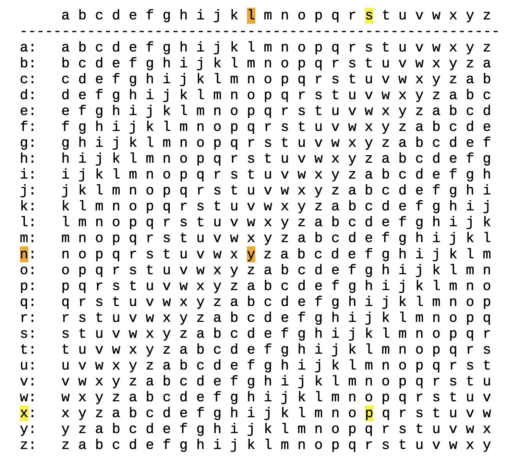
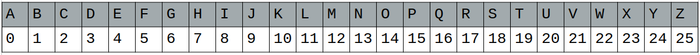
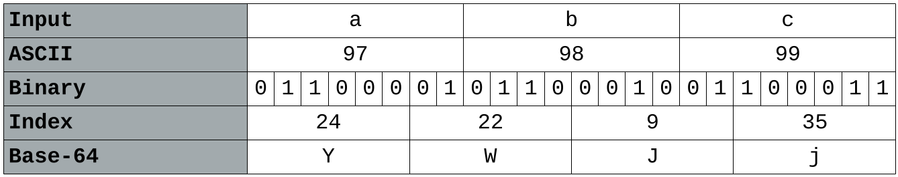
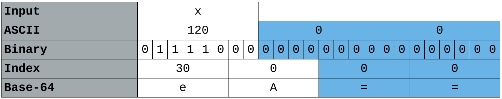
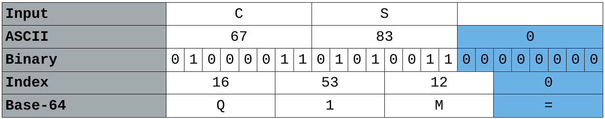
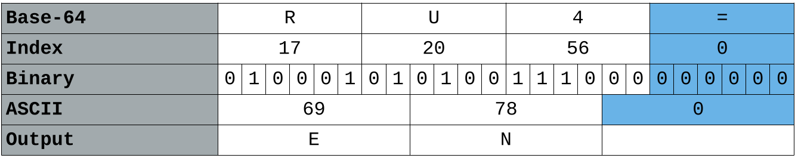
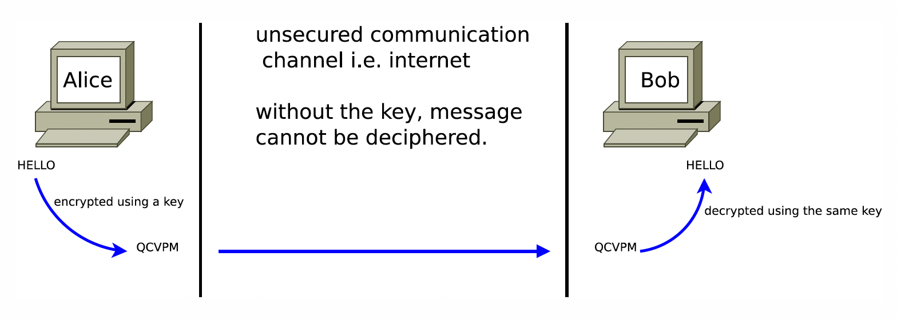
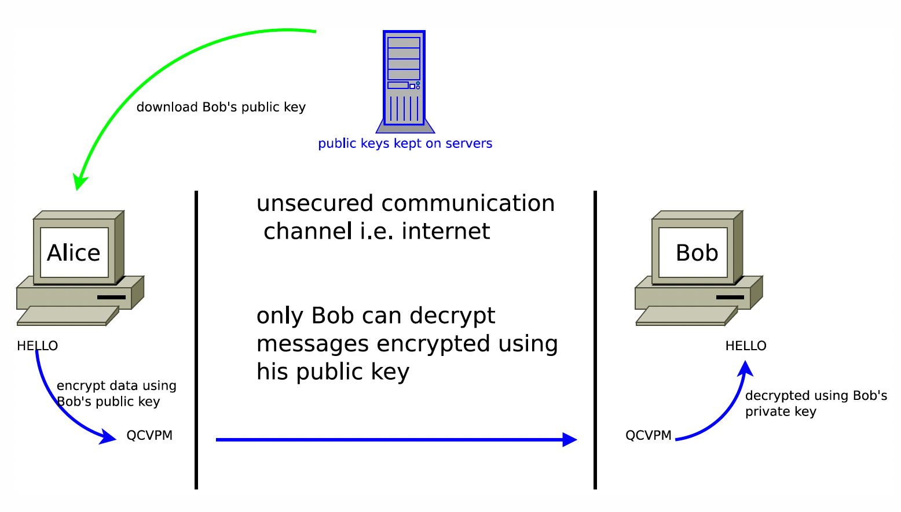

<!-- ============================ DAY 1 ============================ -->

# Introduction

Cryptography has always been about **message confidentiality** — making sure that a
message can only be understood by its sender and intended recipient. It typically
involves converting a message into an incomprehensible format, and then that process
being reversed by the recipient. A good cryptography system should leave a potential
eavesdropper feeling helpless — they should feel like they don't have the time or
energy to figure out what the message says.

Of course, the standard for "time or energy" has changed drastically with computers.
What seemed like an unbreakable cipher to someone working by hand in the 1800s can
now be cracked in milliseconds with a short script. But computers cut both ways — they
also allow us to *create* far more complex encryption systems than any human could
manage by hand.

Even with computers, some categories of problems remain genuinely hard. Recall how
the Towers of Hanoi (from CSC 220 and CSC/CYEN 131) becomes intractable very quickly,
even though the algorithm itself is simple to write. A good cryptography system might
be easy to *understand* — you can explain exactly how it works — but should still
leave even a powerful computer without enough time or memory to recover the original
message. For a sense of scale: a modern 128-bit key has $2^{128} \approx 3.4 \times 10^{38}$
possible values. Even at a trillion guesses per second, trying them all would take
roughly $10^{19}$ years — about a billion times the age of the universe.

::: {.callout-note}
## Key Definitions

| Term | Definition |
|---|---|
| **Cryptology** | The overall field: enciphering and deciphering |
| **Cryptography** | The art of *making* a cipher system |
| **Cryptanalysis** | The art of *breaking* a cipher system |
| **Encryption** | Scrambling a message to hide its meaning |
| **Decryption** | Unscrambling an encrypted message |
| **Plain text** | The original, human-readable message |
| **Cipher text** | The encrypted, unreadable message |
| **Cipher** | The algorithm used to perform encryption or decryption |
| **Key** | The secret value that controls how a cipher encrypts or decrypts |
| **Key space** | The set of all possible keys for a cipher |
:::

---

# A History of Cryptography

Classical cryptography was done with pen, paper, and occasionally simple mechanical
tools. As you read through each cipher below, think about two questions:

1. **How would you break it?** What is the weakness an attacker could exploit?
2. **How hard would it be with modern technology?** Could a script crack it in under
   a second, or would it take longer?

The highlighted passages are cipher text challenges for you to try and decrypt.

---

## Hieroglyphs *(~1900 BC)*

Ancient Egyptians wrote using images and symbols, and ordinary hieroglyphs were simply
a writing system — readable by anyone trained in it. The earliest known example of
*deliberately* altered writing is usually traced to the tomb of the nobleman
Khnumhotep II (around 1900 BC), where the scribe substituted unusual symbols for the
standard ones. The goal was probably to make the inscription seem more impressive or
mysterious rather than to keep a secret, but it is the first recorded instance of
intentionally transforming text.

In a sense, secrecy through an unfamiliar script is no different from writing in any
little-known natural language: the "secrecy" comes entirely from obscurity. The more
people who know the symbols, the less effective they are at keeping messages secret.

::: {.callout-tip}
## How Would You Break It?

Unusual symbols in a known writing system aren't really a cipher — breaking them just
means learning the conventions, or finding a bilingual key (like the Rosetta Stone,
which let historians decode Egyptian hieroglyphs by comparing the same text written in
Greek). The "key" here is really just knowledge of the language itself.
:::

---

## Atbash Cipher *(~500 BC)*

Atbash is a **substitution cipher** where the alphabet is simply reversed: A becomes
Z, B becomes Y, C becomes X, and so on. It is symmetric — applying it twice returns
the original message. Examples of Atbash can actually be found in the Bible [^bible].

[^bible]: See: <https://www.theology.ox.ac.uk/article/crack-the-code>

[rhm'g xibkgltizksb ufm?]{.mark}

You can apply and reverse Atbash on the command line:

```sh
# Create the reversed alphabet z through a
echo {z..a} | tr -d ' '

# Encode or decode a string using Atbash (it's its own inverse)
echo "abcde" | tr a-z "zyxwvutsrqponmlkjihgfedcba"
```

::: {.callout-tip}
## How Would You Break It?

There is only one possible Atbash mapping — there is no key. If you know or suspect
the cipher is Atbash, decryption is instant. A modern script breaks it in
microseconds.
:::

---

## Scytale Cipher *(~7th Century BC)*

The scytale is a physical device associated with the ancient Spartans. A strip of
parchment was wound around a cylindrical rod, and the message was written along the
length of the rod. When the strip was unwound, the letters appeared in a scrambled
order — a **transposition cipher**, meaning the letters are rearranged rather than
substituted. Only a rod of the same diameter could line the letters back up.

(Historians still debate whether the Spartans used the scytale for secrecy at all, or
mainly as a way to authenticate messages — a rod of the right size proved the message
came from someone official. Either way, it is the classic example of transposition.)

We can model the scytale with a grid. The **key** is the width $W$ — how many letters
fit in one row:

1. Write the plain text into rows of $W$ letters. We use a period (`.`) in place of
   each space, and pad the end with periods so the grid is full.
2. Read the grid off **column by column**, top to bottom. That is the cipher text.

To decrypt, reverse the process: the grid has $R = \text{length} / W$ rows, so write
the cipher text *down* the columns in chunks of $R$, then read *across* the rows.

::: {.callout-note}
## Worked Example

Plain text **"meet at dawn"** → `meet.at.dawn` (12 characters), width $W = 4$:

| | col 1 | col 2 | col 3 | col 4 |
|---|---|---|---|---|
| row 1 | m | e | e | t |
| row 2 | . | a | t | . |
| row 3 | d | a | w | n |

Reading down each column gives `m.d` `eaa` `etw` `t.n`, so the cipher text is
**m.deaaetwt.n**.

To decrypt: 12 characters ÷ 4 columns = 3 rows. Split the cipher text into chunks of 3
(`m.d | eaa | etw | t.n`), write each chunk down a column, and read across.
:::

Now try it yourself. The key is either 4 or 5:

[tpnva.tgoahasedshhmser.r.ir..s.tn.ttozc.saeho.uol.]{.mark}

::: {.callout-tip}
## How Would You Break It?

The key is the width, and the width must divide the message length evenly — so there
are only a handful of candidates to try. The periods help a lot: with the wrong width
they land in random places, but with the right width they fall neatly between real
words. A script can try every width in microseconds and check the result against a
dictionary.

There is also a quick way to recognize that you're looking at a transposition cipher
in the first place: the *letters* are unchanged, only their order is. So the letter
frequencies look exactly like normal English (lots of e, t, a, o…), which would not be
true of a substitution cipher.
:::

---

## Caesar Cipher *(~60 BC)*

The Caesar cipher is another substitution cipher, named after Julius Caesar who
reportedly used it in his personal correspondence. Every letter in the message is
replaced by the letter a fixed number of positions further along in the alphabet,
wrapping around at the end.

Caesar himself shifted by 3 positions: A→D, B→E, C→F, …, X→A, Y→B, Z→C. This
specific version is called **ROT-3**. The most well-known variant today is **ROT-13**,
which shifts by 13 — and because 13 is exactly half of 26, applying it twice returns
the original message (it is its own inverse).

[diwtgh hpxs: du rdjght xi xh]{.mark}

```sh
echo "abcde" | tr a-z d-za-c   # ROT-3 (Caesar's cipher)
echo "abcde" | tr a-z n-za-m   # ROT-13
```

::: {.callout-tip}
## How Would You Break It?

There are only 25 possible shifts (ROT-1 through ROT-25). A human can check all of
them by eye in a few minutes. A script can check all 25 in microseconds and
automatically flag whichever shift produces readable English using a dictionary check.
The Caesar cipher offers essentially zero security against modern computing.
:::

---

## General Substitution Cipher

Caesar and Atbash are both special cases of a more general idea: replace each letter
with *some* other letter, using any fixed scrambled alphabet. The key is the scrambled
alphabet itself. A common way to make one memorable is to start with a keyword
(dropping repeated letters) and follow it with the rest of the alphabet in order:

```sh
# Keyword "cryptids" → cryptids + the remaining letters in order
echo "attack at dawn" | tr a-z cryptidsabefghjklmnoquvwxz
# Output: coocye co pcvh
```

How many keys are there? Any ordering of the 26 letters works, so there are
$26! \approx 4 \times 10^{26}$ possible keys — roughly $2^{88}$. That is far too
many to brute-force, even with modern hardware.

And yet this cipher is easy to break.

::: {.callout-tip}
## How Would You Break It? — Frequency Analysis

Every plain text letter always becomes the *same* cipher text letter, so the patterns
of the language survive encryption. In English, **e** is the most common letter,
followed by **t**, **a**, **o**, **i**, **n**. The most common cipher text letter is
probably **e**; a common three-letter word is probably **the**; a single-letter word
is probably **a** or **i**. Guess a few letters, and the rest fall into place like a
crossword.

This technique, **frequency analysis**, was first described by the Arab scholar
al-Kindi in the 9th century. It was famously used in 1586 to decrypt the letters of
Mary, Queen of Scots, which revealed her part in a plot against Elizabeth I and led
to her execution.

**The lesson: a huge key space does not make a cipher secure.** If the structure of
the plain text leaks through, the attacker never needs to try every key.
:::

---

## Sliding Shift Cipher

The weakness of every cipher so far is that a given letter is always encrypted the
same way. The sliding shift cipher tries to fix this by using a *different* shift for
each position in the message: the first letter is shifted by 1 (ROT-1), the second by
2 (ROT-2), the third by 3 (ROT-3), and so on.

Now the same plain text letter can become many different cipher text letters, which
disrupts simple frequency analysis — but the cipher is still weak.

::: {.callout-tip}
## How Would You Break It?

If an attacker knows the cipher is a sliding shift (or suspects it), the starting
offset is the only unknown. There are only 26 possible starting offsets, making it
barely harder to brute-force than a plain Caesar cipher. This cipher is a stepping
stone to something more powerful — the Vigenère cipher.
:::

---

## Vigenère Cipher *(1553 – 1863)*

The Vigenère cipher generalizes the sliding shift idea by using a **repeating keyword**
as the key, rather than a simple incrementing counter. Each letter of the plain text
is shifted by an amount determined by the corresponding letter of the key. When the
key runs out, it repeats from the beginning.

Despite the name, the cipher was first published by Giovan Battista Bellaso in 1553.
It was misattributed to Blaise de Vigenère in the 19th century, and the name stuck.

For example, with the key `"vigenere"` and the plain text `"how does this work"`:

| Plain text  | H | O | W | D | O | E | S | T | H | I | S | W | O | R | K |
|-------------|---|---|---|---|---|---|---|---|---|---|---|---|---|---|---|
| Key         | V | I | G | E | N | E | R | E | V | I | G | E | N | E | R |
| Cipher text | C | W | C | H | B | I | J | X | C | Q | Y | A | B | V | B |
: Vigenère encryption example {.bordered}

::: {.callout-important}
## Spaces and Punctuation

Only letters are encrypted, and **the key only advances on letters**. Spaces and
punctuation are copied through unchanged and do not use up a key character. Notice
above that the key continues `…R E V I…` straight across the space between "does"
and "this". If you implement Vigenère in code, this is the detail most likely to trip
you up.
:::

The key letter determines the row in the Vigenère table, and the plain text letter
determines the column. Where they intersect is the cipher text character.



To **encrypt**: find the plain text letter's column and the key letter's row — the
intersection is your cipher text. For example, plain text **l** with key **n** gives
cipher text **y**.

To **decrypt**: find the key letter's row, then find the cipher text character in that
row. The column header it falls under is the plain text character. For example, cipher
text **p** with key character **x** gives plain text **s**.

### The Math Behind It

Performing lookups in a table by hand is slow. Computers make this far faster using
arithmetic. If we assign each letter a number (a=0, b=1, …, z=25), the Vigenère
cipher becomes simple modular addition.



For example: plain text **l** has value 11, key character **n** has value 13.
$(11+13) \% 26 = 24$, which maps to **y** — the same result as the table lookup.

More formally, if $P$ is the plain text, $K$ the key, $C$ the cipher text, and
the subscript $i$ the character at position $i$:

$$C_i = (P_i + K_i) \% 26$$

To decrypt:

$$P_i = (26 + C_i - K_i) \% 26$$

The 26 is added before subtracting to avoid negative numbers, since different
programming languages handle the modulo of negative numbers inconsistently.

::: {.callout-note}
## Worked Example

Plain text: **"cyberstorm is going to be bussin"** — Key: **"cryptids"**

| Position | Plain | Key | Calculation | Cipher |
|---|---|---|---|---|
| 0 | c (2) | c (2) | (2+2)%26 = 4 | **e** |
| 1 | y (24) | r (17) | (24+17)%26 = 15 | **p** |
| 2 | b (1) | y (24) | (1+24)%26 = 25 | **z** |
| 3 | e (4) | p (15) | (4+15)%26 = 19 | **t** |
| 4 | r (17) | t (19) | (17+19)%26 = 10 | **k** |
| 5 | s (18) | i (8) | (18+8)%26 = 0 | **a** |
| 6 | t (19) | d (3) | (19+3)%26 = 22 | **w** |
| … | … | … | … | … |

Cipher text: **epztkawgtd gh zwlfi km qx jxkuzl**

To decrypt **"avq nhcu htfdtlarj wjcs ucvkke. Ft'l maltr. Ld vis."** with the same key:

| Position | Cipher | Key | Calculation | Plain |
|---|---|---|---|---|
| 0 | a (0) | c (2) | (26+0−2)%26 = 24 | **y** |
| 1 | v (21) | r (17) | (26+21−17)%26 = 4 | **e** |
| 2 | q (16) | y (24) | (26+16−24)%26 = 18 | **s** |
| 3 | n (13) | p (15) | (26+13−15)%26 = 24 | **y** |
| 4 | h (7) | t (19) | (26+7−19)%26 = 14 | **o** |
| 5 | c (2) | i (8) | (26+2−8)%26 = 20 | **u** |
| 6 | u (20) | d (3) | (26+20−3)%26 = 17 | **r** |
| … | … | … | … | … |

Plain text: **yes your …**
:::

::: {.callout-note}
## Characters as Numbers in Code

Since many programming languages store characters as integers internally, converting
a character to its numerical value (0–25) is as simple as subtracting the character
code of `'a'`:

```python
# Python
ord('l') - ord('a')   # → 11
ord('n') - ord('a')   # → 13
```

```cpp
// C++
int upper = 'P' - 'A';   // → 15  (80 - 65)
int lower = 'p' - 'a';   // → 15  (112 - 97)
```

```rust
// Rust
// Byte literals (b'…') have type u8, so arithmetic works directly.
println!("{}", b'l' - b'a');   // → 11  (108 - 97)
println!("{}", b'P' - b'A');   // → 15  (80 - 65)

// A plain 'l' is a char, which does NOT support arithmetic —
// cast it to a number first:
let ch = 'l';
let val = ch as u8 - b'a';     // → 11
```

Rust's `char` type is a 4-byte **Unicode scalar value**, which can represent any
Unicode character — not just ASCII. Unlike C++, Rust will not let you subtract two
`char`s directly; you either use byte literals like `b'a'` (type `u8`) or cast with
`as u8`/`as u32`. For the purposes of Vigenère encryption over the English alphabet,
the result is identical to Python and C++.
:::

::: {.callout-tip}
## How Would You Break It?

The Vigenère cipher was nicknamed *le chiffre indéchiffrable* ("the indecipherable
cipher") and resisted attack for about 300 years — until Charles Babbage (around 1854,
unpublished) and Friedrich Kasiski (published 1863) independently cracked it using
**frequency analysis** combined with **key length detection**.

The key insight is that if you can figure out the key length $n$, you can split the
cipher text into $n$ groups (all characters encrypted with the same key letter) and
treat each group as a simple Caesar cipher — which is easily cracked with the same
English letter frequency statistics used against substitution ciphers.

Key length detection: look for repeated sequences of characters in the cipher text.
The distances between repetitions tend to be multiples of the key length. A modern
script can determine key length and break the cipher in well under a second.
:::

---

## One-Time Pad *(1917 – present)*

The Vigenère cipher broke because the key *repeats*. So what if it didn't? Suppose the
key is:

1. **truly random**,
2. **at least as long as the message**, and
3. **never used again**.

This is the **one-time pad**. In 1949, Claude Shannon proved that it has **perfect
secrecy**: without the key, every possible plain text of that length is equally
likely. The cipher text `xqzv` is just as likely to be "kiss" as "kill". No amount of
computing power helps, because there is no pattern to find.

Computers usually implement the one-time pad with **XOR** ($\oplus$) on bits instead
of addition mod 26. XOR is its own inverse, so the same operation encrypts and
decrypts:

$$C = P \oplus K \qquad P = C \oplus K$$

XOR-ing data with a stream of key bits is also the core idea behind modern **stream
ciphers**, which generate a long pseudo-random key stream from a short key.

::: {.callout-warning}
## Why Isn't Everything a One-Time Pad?

The key must be as long as all the data you will ever send, and both sides need a
copy delivered securely in advance. If you can securely deliver that much key, you
could often just deliver the message.

Worse, reusing a pad even once is catastrophic. If two messages share a key, the key
cancels out:

$$C_1 \oplus C_2 = (P_1 \oplus K) \oplus (P_2 \oplus K) = P_1 \oplus P_2$$

```python
# Python
import os
xor = lambda a, b: bytes(x ^ y for x, y in zip(a, b))

p1, p2 = b"ATTACK AT DAWN", b"RETREAT AT TEN"
key = os.urandom(len(p1))
c1, c2 = xor(p1, key), xor(p2, key)   # same key used twice!

# An attacker who guesses one message instantly gets the other
print(xor(xor(c1, c2), p1))           # → b'RETREAT AT TEN'
```

```rust
// Rust
use std::fs::File;
use std::io::Read;

fn xor(a: &[u8], b: &[u8]) -> Vec<u8> {
    a.iter().zip(b).map(|(x, y)| x ^ y).collect()
}

fn main() {
    let (p1, p2) = (b"ATTACK AT DAWN", b"RETREAT AT TEN");
    let mut key = vec![0u8; p1.len()];
    File::open("/dev/urandom").unwrap().read_exact(&mut key).unwrap();
    let (c1, c2) = (xor(p1, &key), xor(p2, &key)); // same key used twice!

    // An attacker who guesses one message instantly gets the other
    let p2_recovered = xor(&xor(&c1, &c2), p1);
    println!("{}", String::from_utf8_lossy(&p2_recovered)); // → RETREAT AT TEN
}
```

This really happened: during the 1940s, the Soviet Union reused some of its one-time
pad pages, and the U.S. **Venona** project used the repetition to decrypt thousands
of Soviet intelligence messages.
:::

---

::: {.callout-important}
## How Computers Changed Cryptography

Historically, cryptography was almost always about hiding written text. Computers
changed the game in three fundamental ways:

1. **Speed** — Computers can attempt billions of decryptions per second, making
   short keys or small key spaces completely insecure.
2. **Complexity** — Computers can execute ciphers that would be impossibly slow to
   carry out by hand, enabling far more sophisticated algorithms.
3. **Scope** — Computers can encrypt *any* digital data — images, executables,
   video, databases — not just text. Anything representable as 1s and 0s can be
   encrypted. This is arguably the most transformative change.
:::

---

# Encoding

Before looking at modern cryptography, we need to be clear about something that is
*not* cryptography. Many transformations are simply about **representing** information
in a format that is convenient to store or transmit. These representations are called
**encodings** — and unlike encryption, they involve no secret key and no intent to
hide meaning.

::: {.callout-warning}
## Encoding Is Not Encryption

This is a common source of confusion. Encoding (e.g. Base64) is a reversible
transformation with a publicly known algorithm and no key. Anyone who knows the
encoding scheme can reverse it instantly. **Encoded data is not secret.** Do not
use Base64 as a substitute for encryption.
:::

## ASCII

**ASCII (American Standard Code for Information Interchange)** is the foundational
encoding scheme for representing text in computers. It is a **7-bit** code with 128
possible characters — enough for uppercase and lowercase English letters, digits,
punctuation, and control characters (like newline and tab). Because computers store
data in 8-bit bytes, each ASCII character occupies one byte with the top bit set to 0.

(You may hear of "extended ASCII" with 256 characters. There is no single extended
ASCII — it is a family of incompatible 8-bit code pages, like Latin-1 and
Windows-1252, that each used the extra 128 values differently.)

Common values to know:

| Character | Decimal | Binary |
|---|---|---|
| `A` | 65 | 01000001 |
| `B` | 66 | 01000010 |
| `a` | 97 | 01100001 |
| `b` | 98 | 01100010 |
| `0` | 48 | 00110000 |
| Space | 32 | 00100000 |

Notice that lowercase letters have values exactly 32 higher than their uppercase
counterparts — which is why flipping bit 5 (value 32) toggles between upper and
lowercase in ASCII.

::: {.callout-note}
## Why Does This Matter for Cryptography?

When we perform Vigenère encryption by mapping `'a'` → 0, `'b'` → 1, …, we are
working with ASCII values and subtracting the base offset. Understanding that
characters *are* numbers at the hardware level is fundamental to implementing any
cipher in code.
:::

## UTF-8

128 characters is not enough for the world's languages, so modern systems use
**Unicode**, which assigns a number (a *code point*) to over 150,000 characters. The
most common way to store Unicode is **UTF-8**, which uses 1 to 4 bytes per character.
UTF-8 was designed so that every ASCII character is stored as the same single byte it
always was — so plain English text is identical in ASCII and UTF-8.

```sh
printf 'A' | od -An -tx1   # → 41        (1 byte, same as ASCII)
printf 'é' | od -An -tx1   # → c3 a9     (2 bytes in UTF-8)
```

This is why Rust distinguishes a string's `.bytes()` from its `.chars()`: a single
character may take several bytes, so iterating over a Rust `String` by *byte* and by
*char* can give different results (`"é".len()` is 2, but `"é".chars().count()` is 1).

## Base64

**Base64** was created to solve a practical problem: how do you send arbitrary binary
data (like an image or a file attachment) over a channel that was designed to carry
only printable text? Early email systems, for example, could not reliably handle raw
binary bytes — so the MIME email standard adopted Base64 as a way to represent any
binary data using only 64 safe printable characters.

You can identify Base64-encoded data by its character set: only uppercase letters,
lowercase letters, digits, `+`, and `/`, often with one or two `=` signs at the end.
You will also see a **URL-safe** variant that uses `-` and `_` instead of `+` and `/`
(since those have special meanings in URLs) — for example, in JSON Web Tokens (JWTs)
used for web logins.

### How Base64 Works

The conversion process follows the same principle as converting binary to hexadecimal:
group the bits, then look up each group in the encoding table. For Base64, the group
size is **6 bits** (since $2^6 = 64$). Every 3 input bytes (24 bits) become exactly 4
output characters.

| Value | Char | Value | Char | Value | Char | Value | Char |
|-------|------|-------|------|-------|------|-------|------|
| 0     | A    | 16    | Q    | 32    | g    | 48    | w    |
| 1     | B    | 17    | R    | 33    | h    | 49    | x    |
| 2     | C    | 18    | S    | 34    | i    | 50    | y    |
| 3     | D    | 19    | T    | 35    | j    | 51    | z    |
| 4     | E    | 20    | U    | 36    | k    | 52    | 0    |
| 5     | F    | 21    | V    | 37    | l    | 53    | 1    |
| 6     | G    | 22    | W    | 38    | m    | 54    | 2    |
| 7     | H    | 23    | X    | 39    | n    | 55    | 3    |
| 8     | I    | 24    | Y    | 40    | o    | 56    | 4    |
| 9     | J    | 25    | Z    | 41    | p    | 57    | 5    |
| 10    | K    | 26    | a    | 42    | q    | 58    | 6    |
| 11    | L    | 27    | b    | 43    | r    | 59    | 7    |
| 12    | M    | 28    | c    | 44    | s    | 60    | 8    |
| 13    | N    | 29    | d    | 45    | t    | 61    | 9    |
| 14    | O    | 30    | e    | 46    | u    | 62    | +    |
| 15    | P    | 31    | f    | 47    | v    | 63    | /    |
: Standard Base64 encoding table {.bordered .striped .hover}

### Worked Example: `"abc"` → Base64



Take the ASCII bytes for `a`, `b`, `c` (01100001, 01100010, 01100011), concatenate
the 24 bits, split into groups of 6, and look each up in the table. The result is
**YWJj** — a perfect conversion since 3 bytes × 8 bits = 24 bits, which divides
evenly into four groups of 6.

```sh
echo -n "abc" | base64   # -n suppresses the trailing newline
# Output: YWJj
```

### Padding with `=`

Base64 output always comes in blocks of 4 characters, one block per 3 input bytes.
When the input length is not a multiple of 3, the last block is short. Two things
happen:

1. **Zero bits** are added to the end of the data so the final 6-bit group is full.
2. **`=` characters** are added to the output to fill out the 4-character block.
   Each `=` stands for one input byte that was missing from the final group of 3.

So one leftover byte produces `==`, and two leftover bytes produce `=`.

**Example: `"x"` → Base64**



`x` is a single byte (8 bits). Two 6-bit groups need 12 bits, so 4 zero bits are
added: `011110 000000` → `e`, `A`. The final group of 3 was missing two bytes, so two
`=` are appended. The result is **eA==**.

**Example: `"CS"` → Base64**



Two bytes = 16 bits. Three 6-bit groups need 18 bits, so 2 zero bits are added. The
final group of 3 was missing one byte, so one `=` is appended. The result is **Q1M=**.

```sh
echo -n "CS" | base64
# Output: Q1M=
```

### Decoding Base64

**Example: `"RU4="` → ASCII**



Strip the `=`, convert each Base64 character to its 6-bit value, concatenate the bits,
drop the leftover zero bits at the end, and group into 8-bit ASCII bytes. The result
is **EN**.

```sh
echo -n "RU4=" | base64 -d   # -d decodes Base64
# Output: EN
```

---

<!-- ============================ DAY 2 ============================ -->

# Cryptography Today

The internet created a need for cryptography far beyond simple message confidentiality.
We now communicate over a network that no single entity controls, where bad actors can
intercept traffic at many points. Modern cryptography must solve several distinct
problems simultaneously:

- **Confidentiality** — only the intended recipient can read the message
- **Integrity** — the message has not been altered in transit
- **Authenticity** — the sender is who they claim to be
- **Non-repudiation** — the sender cannot later deny having sent the message

The three major tools used to address these problems are symmetric encryption,
asymmetric cryptography, and hashing.

::: {.callout-note}
## Kerckhoffs's Principle

In 1883, Auguste Kerckhoffs argued that a cipher should remain secure **even if the
enemy knows everything about the system except the key**. Every modern algorithm
below is public — published, standardized, and studied by researchers worldwide. The
security lives entirely in the key. "Security through obscurity" (hoping the attacker
doesn't know your algorithm) is not considered security at all.
:::

---

## Symmetric-Key Cryptography

**Symmetric-key cryptography** works like the classical ciphers above: both the sender
and receiver share the same secret key, which is used for both encryption and
decryption. Depending on the algorithm, data can be encrypted as a continuous stream
(**stream ciphers**, which XOR the data with a key stream, like a one-time pad) or in
fixed-size chunks (**block ciphers**, where each block is encrypted as a unit).



The algorithms you should know:

- **AES** (Advanced Encryption Standard) — the modern standard block cipher, with
  hardware acceleration built into nearly every CPU
- **ChaCha20** — a modern stream cipher, fast on devices without AES hardware (common
  on phones), and used alongside AES in TLS

You will also encounter older algorithms in legacy systems. **DES** and **3DES** are
retired — NIST disallowed 3DES for encryption after 2023 — and **Blowfish**'s small
64-bit block makes it vulnerable to the Sweet32 attack on long sessions. **Serpent**
and **Twofish** (AES finalists) are still considered secure but are rarely used.

Symmetric encryption is generally **fast** and computationally inexpensive, making it
well-suited for encrypting large amounts of data — video streams, disk volumes,
database records, and so on.

### Block Cipher Modes: The ECB Penguin

AES encrypts exactly 16 bytes at a time. To encrypt anything longer, you need a
**mode of operation** — a rule for chaining blocks together. The naive approach,
**ECB (Electronic Codebook)**, encrypts each block independently. That means identical
plain text blocks always produce identical cipher text blocks — the same flaw as a
substitution cipher, just with 16-byte "letters".

```sh
# Four identical 16-byte blocks of plain text
printf 'YELLOW SUBMARINE%.0s' 1 2 3 4 > blocks.txt
KEY=000102030405060708090a0b0c0d0e0f

# ECB: every cipher text block is identical — the pattern leaks
openssl enc -aes-128-ecb -K $KEY -nopad -in blocks.txt | od -v -An -tx1

# CBC: each block is mixed with the previous one — no visible pattern
openssl enc -aes-128-cbc -K $KEY -iv $KEY -nopad -in blocks.txt | od -v -An -tx1
```

The famous illustration of this is the **ECB penguin**: an image of the Linux mascot
encrypted with ECB, where the outline of the penguin is still clearly visible in the
"encrypted" image. Search for it — it makes the point better than any explanation.

(The fixed key and IV above are for demonstration only. Real systems use a random key
and a fresh random IV for every message.)

::: {.callout-tip}
## Authenticated Encryption

Modern systems use **authenticated encryption** modes such as **AES-GCM** or
**ChaCha20-Poly1305**. These provide confidentiality *and* detect tampering — if even
one bit of the cipher text is changed, decryption fails instead of silently producing
garbage. If you ever need to encrypt data in your own code, use one of these through
a well-reviewed library rather than building your own construction.
:::

::: {.callout-warning}
## The Key Distribution Problem

The fundamental weakness of symmetric encryption is the **key distribution problem**.
If Alice and Bob want to communicate securely, they must first agree on a shared key —
but how do they share that key securely if they have no secure channel yet? Meeting in
person is often impractical, and sending the key over the internet defeats the purpose.

This is precisely the problem that asymmetric cryptography was designed to solve.
:::

---

## Asymmetric Cryptography

**Asymmetric cryptography** (also called **public-key cryptography**) solves the key
distribution problem by using *two* mathematically linked keys: a **public key**,
which can be shared with anyone, and a **private key**, which is never shared. It is
computationally infeasible to derive the private key from the public key.

The mathematical hardness usually comes from number theory. The most famous example
is **factoring large numbers**: it is easy to multiply two large prime numbers
together, but extraordinarily difficult to factor the result back into its prime
components. This asymmetry — easy one way, hard the other — is the foundation of RSA.
Newer systems use the **discrete logarithm problem on elliptic curves**, which gives
the same security with much smaller keys (a 256-bit elliptic curve key is roughly as
strong as a 3072-bit RSA key).



### Confidential Communication

To send Alice a private message, Bob obtains Alice's public key (which she has
published openly) and encrypts the message with it. Only Alice's private key can
decrypt it — and only Alice has that. Even Bob cannot decrypt his own message after
sending it.

This solves key distribution: Alice and Bob never need to have met, and no secret
has ever been transmitted over an insecure channel.

### Key Exchange

A closely related idea is **key exchange** (or *key agreement*). With **Diffie-Hellman**,
Alice and Bob each generate a temporary key pair and swap public keys over the open
network. Each side combines their own private key with the other's public key, and
the math guarantees they both arrive at the **same shared secret** — which an
eavesdropper who saw both public keys cannot compute. That shared secret then becomes
a symmetric key. Nothing secret ever crosses the wire.

### Digital Signatures

Public-key cryptography can also prove *who* created a message. To sign a message,
Alice first **hashes** it (see the Hashing section below), then runs a signing
algorithm on that hash using her **private key**. The result is a short **signature**
she attaches to the message. Anyone with her **public key** can run the verification
algorithm on the message and signature: it succeeds only if the signature was made
with Alice's private key *and* the message has not changed since.

Note that a signature does not hide the message — signed messages are usually sent
in the clear. Signatures answer different questions:

- **Is this message from a trusted source?** (authenticity)
- **Has this message been modified in transit?** (integrity)
- **Can the sender later deny sending it?** (non-repudiation — only Alice could have
  produced the signature)

::: {.callout-note}
## "Isn't Signing Just Encrypting With the Private Key?"

You will often see signatures explained this way. It is a rough intuition that
happens to work for textbook RSA, where the signing and decryption operations use the
same math. But it is not true in general: signature schemes like ECDSA and Ed25519
involve no encryption at all, and even real-world RSA signatures add hashing and
padding steps that differ from RSA encryption. Think of signing and encrypting as two
separate operations that happen to use the same key pairs.
:::

You interact with signatures every time you visit an HTTPS website. Your browser
verifies the server's digital certificate — signed by a trusted Certificate Authority —
to confirm that it is talking to the genuine server and not an imposter.

::: {.callout-note}
## Common Asymmetric Algorithms

- **RSA** — the classic; used for both encryption and signatures; security based on
  integer factorization
- **Diffie-Hellman / ECDH** — key *exchange* protocols (not encryption directly);
  **X25519** is the elliptic curve version used in most TLS connections today
- **ECDSA** — elliptic curve signatures; used in many TLS certificates
- **Ed25519** — a modern, fast elliptic curve signature scheme; the default key type
  for new SSH keys (`ssh-keygen -t ed25519`)
- **DSA** — an older signature algorithm, now retired (it was dropped from the
  current U.S. federal signature standard, FIPS 186-5, for new signatures)

You can see which algorithms a website uses by clicking the site information icon at
the left of your browser's address bar and viewing the certificate details.
:::

::: {.callout-tip}
## Symmetric + Asymmetric in Practice: TLS

In the real world, these approaches are almost always used *together*. Asymmetric
cryptography is powerful but slow, so it is used only to set up a connection. When
you connect to an HTTPS site with TLS 1.3:

1. Your browser and the server perform an **ephemeral Diffie-Hellman key exchange**
   to agree on a fresh shared secret.
2. The server **signs** the handshake with the private key belonging to its
   certificate, proving you are talking to the real server and not a
   man-in-the-middle.
3. Both sides derive **symmetric keys** from the shared secret, and all the actual
   data is encrypted with fast symmetric encryption (AES-GCM or ChaCha20-Poly1305).

Because the Diffie-Hellman keys are thrown away after each session, even an attacker
who later steals the server's private key cannot decrypt recorded past sessions.
This property is called **forward secrecy**. (Older versions of TLS allowed
encrypting the session key directly with the server's RSA key, which did *not* have
forward secrecy — TLS 1.3 removed that option.)
:::

---

## Hands-On Demo: GPG in the Terminal

`gpg` (GNU Privacy Guard) is a widely used open-source tool that implements both
symmetric and asymmetric encryption. It is installed by default on most Linux
distributions and is easy to install on macOS (`brew install gnupg`) and Windows
(Gpg4win). The demos below let you see both modes side by side on any Unix-like
terminal.

### Symmetric Encryption with GPG

In symmetric mode, GPG prompts you for a passphrase and uses it to encrypt the
file. The same passphrase is required to decrypt it — this is exactly the
shared-secret model described above.

```sh
# --- ENCRYPT ---
echo "This is a secret message." > plaintext.txt

gpg --symmetric \
    --cipher-algo AES256 \
    --output encrypted.gpg \
    plaintext.txt
# GPG will prompt for a passphrase twice (enter: mysecretpassword)

# Confirm the output is unreadable: view the first bytes as hex
# (cat-ing binary data can scramble your terminal)
od -An -tx1 encrypted.gpg | head -4

# GPG caches your passphrase for a few minutes. Clear the cache
# so that decryption actually asks for it:
gpgconf --reload gpg-agent

# --- DECRYPT ---
gpg --decrypt \
    --output decrypted.txt \
    encrypted.gpg
# Enter the same passphrase when prompted

cat decrypted.txt   # → "This is a secret message."
```

::: {.callout-note}
## What's Happening Under the Hood

GPG derives an AES-256 key from your passphrase using a **key derivation
function** (S2K — String-to-Key). The passphrase itself is never stored — only
the cipher text. Lose the passphrase and the data is gone.
:::

---

### Asymmetric Encryption with GPG

In asymmetric mode, GPG uses a **key pair**: a public key to encrypt and a
private key to decrypt. To make the demo realistic, we give Alice and Bob
**separate keyrings** (GPG's name for the folder where it stores keys) using
`--homedir`. That way, Bob really only has what Alice has sent him.

```sh
# --- SETUP: separate keyrings for Alice and Bob ---
ALICE=$(mktemp -d)   # Alice's keyring folder
BOB=$(mktemp -d)     # Bob's keyring folder

# --- STEP 1: Alice generates a key pair ---
# (--passphrase '' leaves the private key unprotected: fine for a demo,
#  never for a real key)
gpg --homedir "$ALICE" --batch --passphrase '' \
    --quick-gen-key "Alice Example <alice@example.com>" default default never

# --- STEP 2: Alice exports her public key ---
gpg --homedir "$ALICE" --armor --export alice@example.com > alice_public.asc
cat alice_public.asc   # Safe to share openly — this is the PUBLIC key

# --- STEP 3: Bob imports Alice's public key and encrypts a message ---
echo "Hey Alice, meet me at the library at noon." > message.txt

gpg --homedir "$BOB" --import alice_public.asc

gpg --homedir "$BOB" --trust-model always \
    --encrypt --recipient alice@example.com \
    --armor --output message_for_alice.asc \
    message.txt

cat message_for_alice.asc   # Unreadable without Alice's private key

# --- STEP 4: Alice decrypts with her private key ---
gpg --homedir "$ALICE" --decrypt \
    --output received_message.txt \
    message_for_alice.asc

cat received_message.txt   # → "Hey Alice, meet me at the library at noon."
```

::: {.callout-tip}
## Try Breaking It

Have Bob try to decrypt the message he just encrypted:

```sh
gpg --homedir "$BOB" --decrypt message_for_alice.asc
# → gpg: decryption failed: No secret key
```

Bob wrote the message and holds Alice's public key, but he still cannot read the
cipher text. Only the private key can decrypt it, and it never left Alice's keyring.
:::

::: {.callout-note}
## Why `--trust-model always`?

Without it, GPG stops and asks Bob whether he is *sure* this key really belongs to
Alice. That is a fair question! Anyone can generate a key labeled
"alice@example.com". Public-key cryptography solves the problem of *sharing* keys,
but you still need some way to trust that a public key belongs to the right person.
GPG handles this with a "web of trust" (people vouching for each other's keys); the
web uses Certificate Authorities. For a demo, we tell GPG to skip the check.
:::

### Digital Signatures with GPG

GPG also supports **signing** — Alice uses her *private* key to sign a message,
and anyone with her public key (like Bob) can verify the signature. This proves both
**authenticity** (the message came from Alice) and **integrity** (it was not
modified in transit).

```sh
# Alice signs a message with her private key
echo "I, Alice, approve this document." > statement.txt

gpg --homedir "$ALICE" --clearsign \
    --local-user alice@example.com \
    --output statement_signed.asc \
    statement.txt

cat statement_signed.asc   # Plain text + signature block appended

# Bob verifies it with Alice's public key
gpg --homedir "$BOB" --verify statement_signed.asc
# → gpg: Good signature from "Alice Example <alice@example.com>"
#   (plus a warning that Bob hasn't certified the key: see the note above)

# Tamper with the signed file and verify again
# (-i.bak works with both GNU sed on Linux and BSD sed on macOS)
sed -i.bak 's/approve/reject/' statement_signed.asc
gpg --homedir "$BOB" --verify statement_signed.asc
# → gpg: BAD signature from "Alice Example <alice@example.com>"
```

::: {.callout-note}
## Clean Up

Because the demo keys live in temporary folders, cleaning up is just:

```sh
rm -rf "$ALICE" "$BOB"
```
:::

---

## Hashing

**Hashing** is a third application of cryptography that works quite differently from
encryption. A hash function takes an input of any size and produces a **fixed-size
output** (the *hash* or *digest*) — and crucially, this process is **one-way**: you
cannot recover the original input from the hash.

At first this sounds counterproductive. Why scramble a message into gibberish if you
can never unscramble it? The answer lies in the properties of a good cryptographic
hash function:

1. **Determinism** — the same input always produces the same hash.
2. **Preimage resistance** (one-way) — given a hash, it is infeasible to find an
   input that produces it.
3. **Second-preimage resistance** — given an input, it is infeasible to find a
   *different* input with the same hash.
4. **Collision resistance** — it is infeasible to find *any* two different inputs
   that produce the same hash.

These properties together make hashes useful for **verification without storage
of the original data**.

### File Integrity Checking

Imagine downloading a 4 GB Linux ISO on a slow connection. The server publishes the
SHA-256 hash of the legitimate file. Once your download completes, you run the same
hash function on your local copy — a process that takes only a few seconds. If your
hash matches the published hash, your file is byte-for-byte identical to the
original. If they differ, the file was corrupted during download.

::: {.callout-warning}
## Where Did the Hash Come From?

A hash only protects you if you got it from a source the attacker can't control. If
an attacker breaks into the download server, they can replace *both* the file and
the hash next to it. This happened in 2016, when attackers hacked the Linux Mint
website and swapped in a backdoored ISO along with a matching hash.

That is why Linux distributions also **digitally sign** their checksum files. You
first verify the signature on the list of hashes (using the distribution's public key),
and only then check your file against the list:

```sh
# Example: Ubuntu publishes SHA256SUMS and a signature, SHA256SUMS.gpg
gpg --verify SHA256SUMS.gpg SHA256SUMS         # is the hash list genuine?
sha256sum -c SHA256SUMS --ignore-missing       # does my ISO match it?
```

Hashing gives integrity; the signature gives authenticity. Together they give you both.
:::

### Password Storage

Storing passwords in plain text is catastrophic when a database is breached — the
attacker instantly has every user's password. Instead, systems store only a *hash*
of each password. When you log in, the system hashes what you typed and compares it
to the stored hash. If they match, you're in — and the original password is never
stored anywhere.

When attackers breach a database and obtain password hashes, they cannot directly
reverse them. Their best option is to guess: hash millions of common passwords (a
**dictionary attack**) and check for matches, or look them up in a **rainbow table**
of pre-computed hashes. This is why long, unique, random passwords are important:
they are far less likely to appear in an attacker's list.

::: {.callout-note}
## Salting

Modern password storage adds a **salt** — a random value combined with the password
before hashing, and stored alongside the hash. Even if two users have the same
password, their salts differ, so their hashes differ. This makes pre-computed rainbow
tables useless and forces the attacker to crack every user's password separately.
Salts do *not* stop an attacker from running a dictionary attack against one
particular user — they just make it impossible to attack everyone at once.
:::

::: {.callout-important}
## Use a Slow Hash for Passwords

General-purpose hash functions like SHA-256 are designed to be *fast* — and that is
exactly the wrong property for passwords. A single modern GPU can compute billions of
SHA-256 hashes per second, so even salted SHA-256 password hashes fall quickly to a
dictionary attack.

Password hashing uses **deliberately slow, memory-hard** functions instead:
**Argon2id** (the current recommendation), **scrypt**, **bcrypt**, or **PBKDF2**.
They have a tunable cost that makes each guess expensive. Compare:

```python
import hashlib, os, time

t = time.perf_counter()
for _ in range(100_000):
    hashlib.sha256(b"hunter2").digest()
print("100,000 SHA-256 hashes:", time.perf_counter() - t, "seconds")

salt = os.urandom(16)
t = time.perf_counter()
hashlib.scrypt(b"hunter2", salt=salt, n=2**14, r=8, p=1)
print("1 scrypt hash:         ", time.perf_counter() - t, "seconds")
```

On a typical laptop, a single scrypt hash takes about as long as 100,000 SHA-256
hashes. A real user logging in never notices the difference — but an attacker making
billions of guesses definitely does. In practice, use your language's
password-hashing library (e.g. `argon2-cffi` or `bcrypt` in Python) rather than
calling hash functions directly.
:::

### Message Authentication Codes (HMAC)

A plain hash detects *accidental* changes, but not deliberate ones: an attacker who
modifies a message can simply recompute its hash. To detect tampering without
public-key signatures, two parties who share a secret key can use an **HMAC**
(Hash-based Message Authentication Code), which mixes the key into the hash. Without
the key, an attacker cannot produce a valid HMAC for a modified message.

```sh
echo -n 'transfer $100 to Bob' | openssl dgst -sha256 -hmac "shared-secret"
```

HMACs are everywhere: API request signing, session cookies, JSON Web Tokens, and
inside TLS itself.

### Common Hash Functions

**MD5** converts any input to a 128-bit (32 hex character) hash. Weaknesses in its
internals were found in the 1990s, and in 2004 researchers produced full collisions —
two different inputs with the same MD5 hash. Collisions can now be generated in
seconds on a laptop. MD5 is broken for any security purpose, but is still sometimes
used as a quick checksum against *accidental* corruption.

```sh
echo -n "hello world" | md5sum   # note the different hash...
echo "hello world" | md5sum      # ...when a newline is included
```

Try changing even a single character in the input — the resulting hash will look
completely different. This is called the **avalanche effect** and is a property of
all good hash functions.

**SHA (Secure Hash Algorithms)** is a family of hash functions standardized by NIST:

- **SHA-1** — 160-bit output; deprecated by NIST in 2011, and the first real collision
  ("SHAttered") was published by Google and CWI in 2017
- **SHA-256** — 256-bit output; widely used today (TLS certificates, Git's newer
  object format, Bitcoin, etc.)
- **SHA-512** — 512-bit output; part of the same SHA-2 family, with a larger output
- **SHA-3** — a newer standard (2015) with a completely different internal design,
  kept as a backup in case SHA-2 is ever weakened

```sh
echo -n "hello world" | sha1sum
echo -n "hello world" | sha256sum
echo -n "hello world" | sha512sum
```

| Algorithm | Output Length | Status |
|---|---|---|
| MD5 | 128 bits (32 hex chars) | Broken — non-security checksums only |
| SHA-1 | 160 bits (40 hex chars) | Broken for collisions — avoid |
| SHA-256 | 256 bits (64 hex chars) | Current standard |
| SHA-512 | 512 bits (128 hex chars) | Current standard |
| SHA3-256 | 256 bits (64 hex chars) | Current standard |

::: {.callout-note}
## On macOS

macOS doesn't include `md5sum` or `sha256sum` by default. Use these instead:

```sh
echo -n "hello world" | md5
echo -n "hello world" | shasum -a 1
echo -n "hello world" | shasum -a 256
echo -n "hello world" | shasum -a 512
```
:::

::: {.callout-tip}
## Hashing in Cybersecurity Competitions

Hash cracking and identification are common challenges in CTFs (Capture the Flag
competitions) and events like Cyber Storm. You will often be given a hash and asked
to find the original value — usually by running a wordlist through the same hash
function and looking for a match. Tools like `hashcat` and `john` (John the Ripper)
automate this. Recognizing which algorithm produced a hash (by its length and
character set) is a useful skill.
:::

---

## Looking Ahead: Quantum Computers and Post-Quantum Cryptography

A large enough **quantum computer** running **Shor's algorithm** could efficiently
factor large numbers and solve elliptic curve discrete logarithms. That would break
RSA, Diffie-Hellman, ECDSA, and Ed25519 — essentially all of the asymmetric
cryptography described above. No quantum computer today is anywhere near large
enough, but the threat is taken seriously for one reason: **"harvest now, decrypt
later."** An adversary can record encrypted traffic today and decrypt it years from
now, once the hardware exists.

Symmetric cryptography and hashing are in much better shape. The best known quantum
attack (Grover's algorithm) roughly halves the effective key length, so AES-256 and
SHA-256 remain comfortably secure.

In August 2024, NIST published the first **post-quantum** standards, based on
mathematical problems (such as problems on *lattices*) that are believed to be hard
even for quantum computers:

- **ML-KEM** (FIPS 203) — key exchange
- **ML-DSA** (FIPS 204) and **SLH-DSA** (FIPS 205) — digital signatures

The transition is already happening. Major browsers and services like Cloudflare now
use a **hybrid** key exchange that combines X25519 with ML-KEM, so a connection stays
secure as long as *either* algorithm holds up — and recent versions of OpenSSH do the
same. There's a good chance the TLS connection you used to download these notes was
already post-quantum.

---

# Summary

This has been a broad tour of cryptography from ancient Sparta to modern HTTPS. The
key threads running through all of it are:

- Security is always relative to what an attacker can *compute*. What was secure in
  1800 is trivially broken today — and what is secure today may need replacing when
  quantum computers arrive.
- A large key space is necessary but not sufficient. The substitution cipher had
  $2^{88}$ keys and still fell to frequency analysis, because patterns in the plain
  text leaked through.
- Modern security comes from **mathematical hardness**, not secrecy of the algorithm
  (**Kerckhoffs's principle**). A good system remains secure even if the attacker
  knows exactly how it works — the security lives entirely in the key.
- Different tools solve different problems. **Encryption** provides
  **confidentiality**. **Hashes** detect accidental changes; **HMACs** and
  **digital signatures** provide **integrity** and **authenticity** against a
  deliberate attacker, and signatures add **non-repudiation**. Real-world systems
  like HTTPS use all of them together.

Some of these topics will be covered in more detail later in the quarter with
hands-on application. Others you will encounter in dedicated courses like
CSC 444/544/CYEN 406.[^long]

[^long]: Typically offered every other year in the Spring quarter. Was last offered in
Spring 2026.
